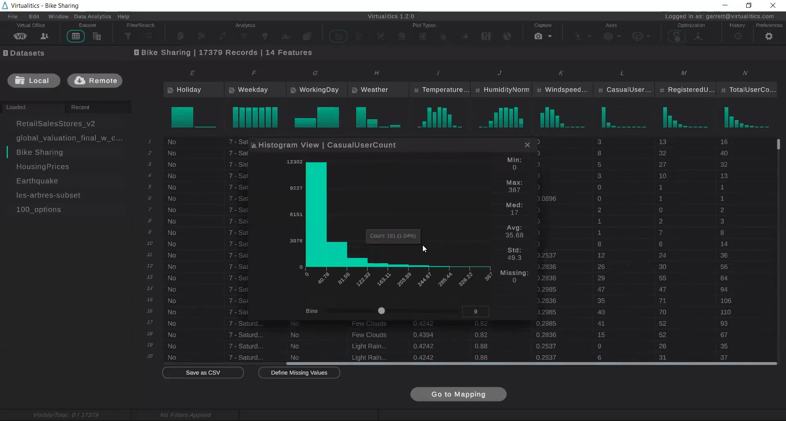
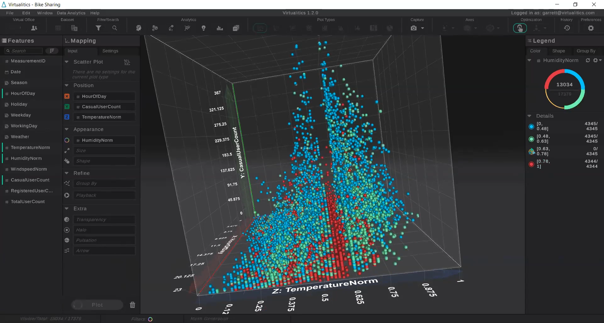
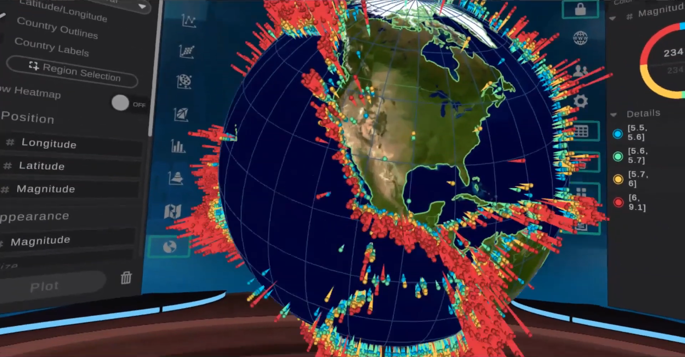
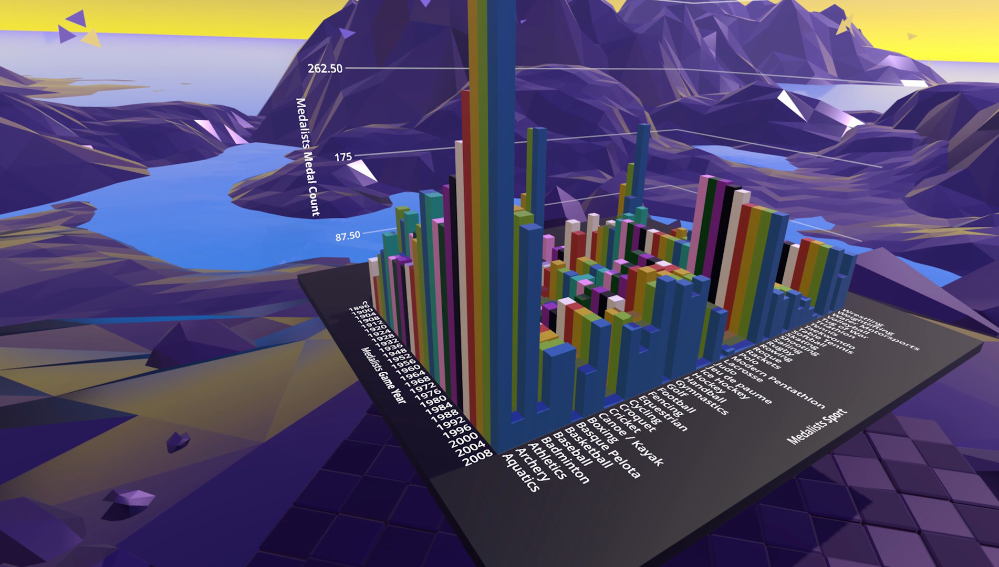
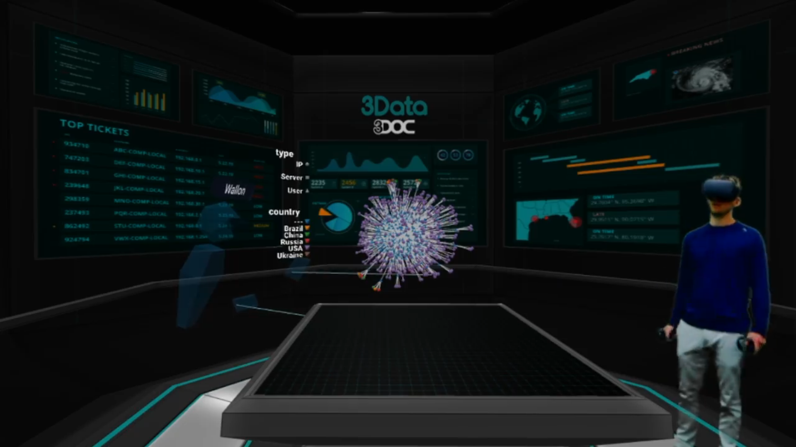

# Existing products

In this part we will focus on analyzing existing VR-enabled visualization tools. Emphasis is given on select features that author perceives as relevant. We will explore data support to see how we can load data onto the platform, as well as options for extensibility via plugins. Due to the rise of mobile HMDs, we will look at how well they are supported in each product. From the feature set, we will focus on machine learning capabilities and collaboration features. Lastly, we will take a quick look at business models of companies that maintain these applications and check availability of editions aimed at end consumers and/or academia.

# Virtualitics

Virtualitics aims to combine the benefits of high-dimensional visualization in VR with those of AI-driven analysis.[1] Virtualitics includes a Windows application for loading, editing and visualizing data in both desktop mode and VR, the later enables the user to visualize data in an immersive environment as well as to collaborate with other users who are represented as avatars. Virtualitics also offers a Python API, which enables programmers to implement an integration into their applications. This API is available in the Python repository under a FOSS license (MIT).[2]

[3]

The interface of their desktop application bears resemblance to Tableau. Data can be loaded from either a local file or a remote database. It includes a *spreadsheet view*, which shows loaded data in a tabular form with histograms and basic statistical information such as mean and median. The user is able to filter data and fill in missing values.

Afterwards, they are able to switch into the *mapping view*, which allows them to map attributes onto dimensions. A unique feature called *smart mapping* offers the user a selection of attributes that are calculated to be the most important in the dataset. The user can also toggle between multiple plot types.

[3]

The VR component dubbed *Virtual Office* allows the user to interact with plots they have defined in the *mapping view* in VR. They are able to access key features of the desktop application using flat panels which look the same as they do in desktop mode. The user can interact with one 3D plot at a time, which is located at the center of the virtual space with 2D plots surrounding the user and offering more insight. The software includes a collaboration feature, enabling the user to invite other stakeholders into their virtual environment.

Virtualitics's Python API enables the user to connect to a running instance of the desktop application and load data from a Pandas data table as well as access certain analytics and visualization features straight from their code.

[3]

Out of the three product that we have analyzed, Virtualitics seems to be the most advanced. It offers a very clean task-driven user interface, powerful tools for analytics, mobile support for Oculus Quest, large number of integrations with an open-source Python API and collaboration features. Negatives include proprietary nature of all other components, which requires users to resort to the aforementioned Python API, lack of support for 3DOF headsets such as Oculus Go or Google Daydream, VR interface that is perhaps too similar to its desktop counterpart and does not fully utilize the capabilities of roomscale VR and, as with all other products mentioned, lack of any consumer or academic version.

# LookVR

LookVR is a virtual reality tool for exploring data that forms part of Looker, an enterprise business analytics platform.[4] Looker enables its customers to connect to more than 50 types of databases. Their BI platform can be accessed via a web browser, a demo of an example dashboard is available.[5] LookVR enables the user to access 3D scatter plots, bar plots as well as more unorthodox plot types hosted on Looker. There does not seem to be any interactivity at all outside of selecting a plot. The software allows the user to push a cartoon-like *big data* button in order to enlarge the visualized plot.

[6]

LookVR is available for free via Steam.[6] If the user's company has access to Looker, they may log in using their credentials, otherwise a small selection of plots is available as a sample. Unfortunately, all of our attempts to load sample data have ended unsuccessfully.

When it comes to LookVR's feature set, it is rather basic. The amount of available plot types is small, there is no support for mobile HMDs, no extensibility or FOSS components and although it is distributed for free via Steam, the requirement of a Looker license does not allow non-enterprise customers to utilize the product.

# 3Data

Austin-based project 3Data started as a 2016 prototype called DataVizVR.[7] As of August 2019, this demo is still available via Oculus Store.[8] The demo features a number of preloaded datasets and enables the user to interact with a single plot via a very spartan user interface. Since then, the product has matured, offering various plot types including terrain maps.

[9]

Its user interface, dubbed *3Data Operations Center*, seems similar to Virtualitics with a plot front and center and details surrounding the user in a virtual room, albeit slightly less polished. Like its competitor, 3Data also offers collaboration features.

The product is sold solely to companies as an applications suite called *3Data Power Office*, which in addition to the VR viewer includes tools for creating immersive presentations and collaboration with other stakeholders. Datasets can be self-hosted, 3Data promises direct connection to databases and existing BI tools.[10]

A defining feature of 3Data is its ability to run across multiple classes of devices. The visualization component makes use of WebVR specification, which enables it to run on VR/AR headsets, handheld mobile devices and personal computers in both 2D and immersive modes.[11] 3Data does not seem to offer a dataset editing tool of its own, relying instead on third-party applications.

At the moment, the product does not support any analytical features, however support for *IBM Watson* is coming soon. After a detailed inspection, we concluded that there are no FOSS components whatsoever.

# Summary

Unfortunately, due to the enterprise nature of analyzed products and lack of a consumer/academic license or trial version, we have not been able to test these applications ourselves. The following chart compares key features of analyzed products.

| | Virtualitics | LookVR | 3Data |
|---|---|---|---|
| Data platform support | Local file, database, Python API, Amazon Redshift | Looker | Database |
| Mobile HMD support | Oculus Quest | None | Go + Quest |
| Extensibility / FOSS | Python API | None | None |
| Machine learning | Clustering, Anomaly detection, PCA, *Smart mapping* | Indirectly through Looker platform | Soon (IBM Watson) |
| Telepresence | Yes | Yes | Yes |
| Consumer version | No | No | No |

1. https://www.virtualitics.com/
2. https://pypi.org/project/pyVIP/
3. https://www.youtube.com/watch?v=p58Lysfv4FY
4. https://looker.com/platform/blocks/embedded/lookvr/
5. https://looker.com/demo/looker-dashboard/
6. https://store.steampowered.com/app/595490/LookVR/
7. https://www.oculus.com/experiences/rift/1251660221572429/
8. https://3data.io/
9. https://www.youtube.com/watch?v=9hd_YmYyGQk
10. https://3data.io/poweroffice/
11. https://webvr.info/