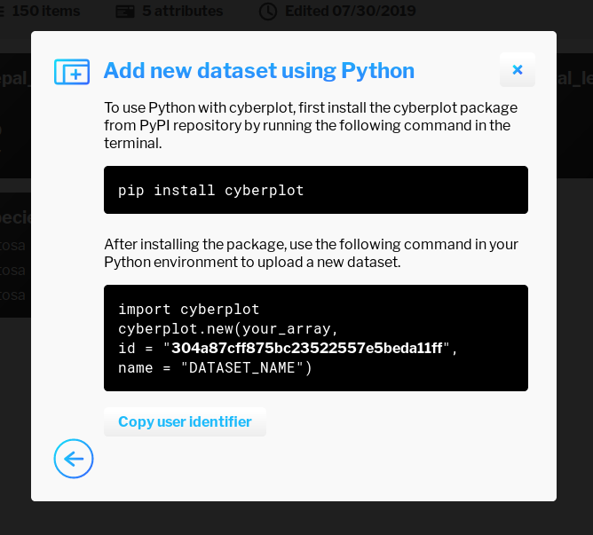
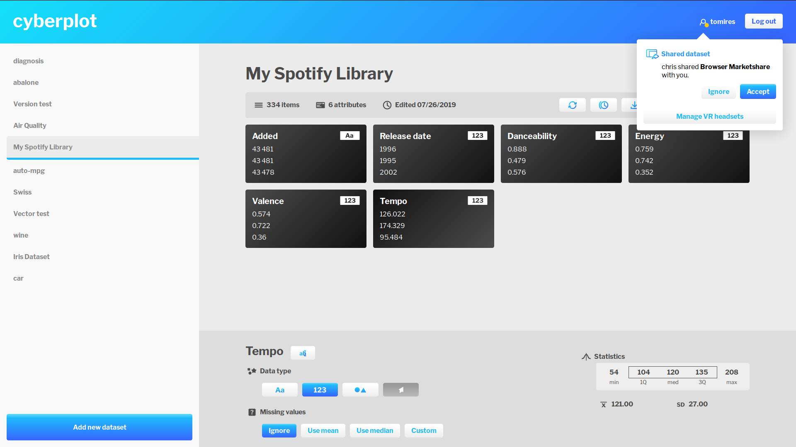
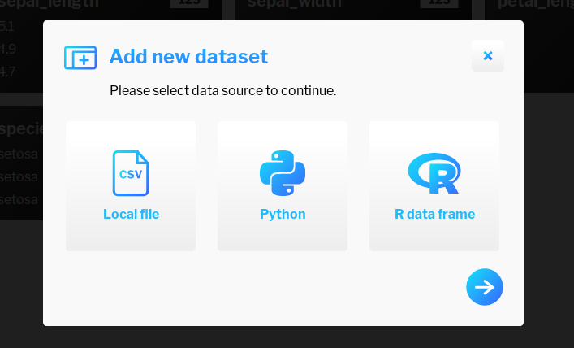
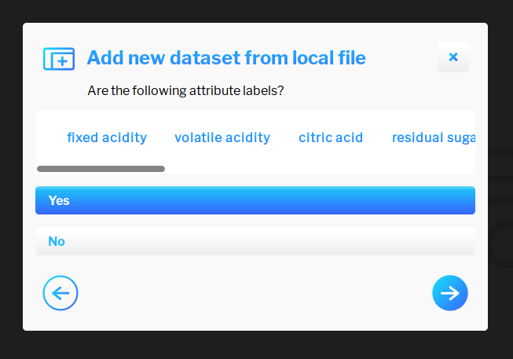
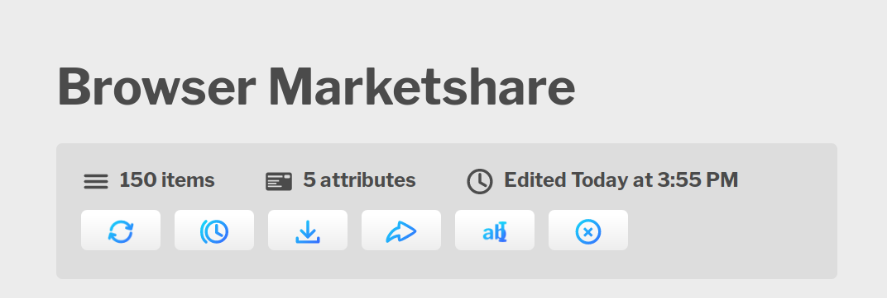
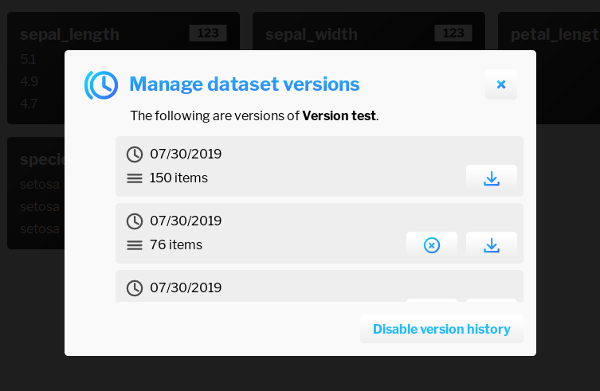

# Design

In this chapter we discuss **X**

## Personas

The following personas characterize potential users of our application.

### Novice


Frank is a hobbyist. He is capable of performing basic computer operations, such as browsing the Internet or using an office suite. Lately, he came across an interesting dataset that highlights population growth in different areas of the world over the past couple centuries. Frank is quite impatient when it comes to computers and gets easily frustrated with complex pieces of software. As such, he is looking for a tool that will enable him to view this data without too much hassle.

### Power user


Quinn is a senior data analyst working in meteorological agency. She possesses advanced programming skills and her current task is to build a networked swarm of drones that gather meteorological data from locations around her neighbourhood. She wants to remotely access the measured data and share measurements from particular days with her colleagues.

### IT administrator


Paul works as an IT technician at a corporate bank. He has been tasked by the company to find and recommend an immersive analytics platform to be used by its employees. Paul wants the software to store data locally in order to achieve compliance with new data regulations, integrate easily with existing processes inside the company and have the ability to audit the software. Although he is an experienced administrator with many years under his belt, he always enjoys software that is hassle-free to run and easy to set up.

## Task analysis

The goal of our research is to create a virtual reality visualization environment that is accessible to everyone, is easily extensible by outside developers and works on 3DOF and 6DOF HMDs, no matter whether they are connected to a personal computer or function as standalone devices. Different control styles should be taken into account when designing interactions. The following graph illustrates tasks that are typical for immersive analytics software (and for the most part, traditional business intelligence tools). High-level tasks are broken down into subtasks as is commonplace in hierarchical task analysis.[x]


The users typically traverse these tasks in order, however, depending on the scenario, they may want to repeat tasks 2-4. It is important to note, that when collaborating with another user, tasks 1-2 can be skipped. Detailed description of each task follows.

| Task | Description |
|---|---|
| Prepare data | The user has to define the underlying structure of data they want to use. This is typically a local file in a certain format or an API provided by a third-party application. They can then proceed to retrieve such data and specify various associated feature (*metadata*), such as attribute types or labels (in case of multivariate data). They are also able to select a subset of data to work with or fill in missing values. |
| Map data | The user makes an informed decision on which plot type they wish to use and associates attributes from their dataset with its features. They are also able to conduct plot-specific filtering (e.g. by modifying the range of displayed values on a spatial axis in scatter plots). |
| Analyze data | This task includes looking at plots from different view points and discovering further information by consulting the legend. |
| Collaborate | Collaboration can be divided into two distinct areas - synchronous and asynchronous. If the user we are collaborating with is available for real-time collaboration, we can invite them to a persistent virtual space and communicate using voice and physical gestures that map onto our virtual avatars. Alternatively, we are able to send them a copy of our dataset, which they can analyze at their leisure. |

## Scenarios

Let us specify three scenarios that highlight certain use cases.

### Loading a dataset from a local file

Frank opens up the application, logs in and proceeds to add a new dataset representing population growth in the last century. He locates a CSV file on his computer and answers a series of simple questions. After the application finishes loading the dataset, he promptly checks whether the data has been correctly loaded and attribute types correctly assigned. He notices that several attributes have been mistyped as numerical instead of locational and that several attribute labels are ambiguous. He proceeds to fix these issues and puts on a virtual reality headset.

Inside VR, Frank selects the dataset he had just uploaded and creates a globe plot. He assigns locational attributes onto compatible features of the plot and specifies a numerical attribute as value. As Frank rotates the globe, he observes several hotspots around the world - eastern portions of China catch his eye. He moves the globe closer towards him and continues to explore.

### Creating an integration

Quinn has recently finished work on her new army of internet-connected drones. She is using Python to periodically gather measurements of temperature, humidity, wind direction and wind speed. Every day at a set time, the drones travel along a pre-programmed path and log measurements at certain locations. These measurements are then dumped into a file, which is stored in the drone's internal memory. Quinn, wanting to utilize the full capabilities of her drone, decides to add an integration to her Python script. She opens up our application, logs into her account and adds the file containing her last measurements as a new dataset. She then turns on a feature called *version history*, that enables her to upload multiple versions of the same dataset.

Quinn proceeds to look up the API key specific to the dataset she had just added along with instructions on how to set up the Python integration. After installing the integration from Python's package manager, she replaces the bit of code that saves measured data as a file with a snippet that she found. The next day after her drones return from their travels, Quinn notices that a new version of data has been added to her dataset. She puts on her VR headset, creates a map plot and assigns attributes from her dataset onto its features. Quinn then changes between the two versions and can see that today's measurements indicate higher humidity in certain areas as well as a change in wind direction.

### Collaborating with another user

Quinn wants to share her findings with her fellow employee, Bob. While in VR, she opens her friends list and notices that Bob is online. She invites him to join her in VR. Bob gets a notification and puts on his VR headset. He accepts the invitation and after waiting several seconds for Quinn's data to load, appears in a shared virtual space beside Quinn's virtual avatar. Quinn then briefs Bob about the current meteorological situation using the application's voice communication functionality. She points to the area of interest and both agree that the situation is unusual. Bob requests a personal copy of the dataset and Quinn is happy to oblige. She takes off her VR headset and sends the dataset to Bob who then receives a prompt to accept the share request.

## Design goals

Let us specify key design goals for our application.

### Inclusivity

The application should be accessible to users without any prior experience with data analysis. Workflows that are expected to be utilized by the vast majority of users should be straightforward. More advanced functionality can be available for experienced users, but its presence should not deter newcomers from using the product.

### Extensibility

The application has to be extensible to a certain degree as to give stakeholders the ability to integrate it with their existing software stack.

### Data security

Users are not to be held hostage inside the application's ecosystem (*vendor lock*). All data should be retrievable with ease by the user and a system administrator where applicable. There should be an option to store data locally without a requirement to connect to outside servers.

### Collaboration

The application should facilitate collaboration between multiple users. They should be able to share data with one another without being forced to resort to external tools. In an optimal scenario, they should have the ability to communicate and interact with one another inside the virtual environment.

### Non-specificity

Use cases of our application should not be limited to a select field or domain of data.

### VR

The application's user interface should be tailor-made for virtual reality. It is to be designed around a spatial environment while mitigating all shortcomings of present-day virtual reality technology.

### Availability

The application is to be available on all major virtual reality platforms across PC, mobile and standalone categories. The user should be able to retain a persistent copy of their data across all devices as they may for instance use a workstation at their workplace and a standalone system at home.

### Automatization

When adding a new dataset, the application should be able to predict certain features, such as attribute type or structure of an uploaded dataset. The user should only be prompted if there is a high degree of uncertainity. In the inverse case, we will choose the most likely settings and allow the user to make modifications later at their leisure.

## Feature selection

**REVISE**

We have selected a number of features to implement for our first prototype, which was made in the space of 4 months (one academic semester). These include the ability to load comma-delimited CSV files into the environment, ability to update existing datasets by either overwriting the existing copy or appending a new copy (*versioning*), letting the user perform basic editing operations such as renaming dataset attributes, setting their data type and missing value setting and a basic dataset sharing feature.

The user should also be able to create various types of plots, position them freely around the virtual environment, adjust their rotation and scale, specify bounds for each spatial axis (*slicing*), assign dataset attributes onto spatial axes and non-spatial features such as color and size and view basic dataset metadata and statistics of attributes contained within said dataset.

Lastly, there should be integration support for popular programming languages that allows programmers to create or update datasets from their programming environment of choice. Since we cannot cater to all, we should provide the ability for outside developers to build their own integrations for other programming languages or environments.

### Plot types

**XX**

## Component design

**EXPAND**

We have decided to divide our environment into three distinct components - plugins, Manager and Navigator. *Plugins* are API integrations written for different programming languages that allow the user to create a new dataset or update an existing one. *Manager* enables the user to view and edit all of their datasets and also facilitates uploading files from a local computer. *Navigator* allows the user to interact with their data in virtual reality. The following visualization pipeline shows the distribution of tasks among our components.

[1]

### Plugins

Plugins are intended for developers or power users to incorporate dataset creation and updating functionality into their applications and scripts. We have implemented integrations for Python and R, as they are the most common programming languages used by data scientists. Manager provides a set of APIs that enable outside developers to create their own integrations and as both Manager and official plugins are open-source[2], it is a very straightforward process.



From the user's perspective, the workflow to add or update a dataset is as follows:

1. Log into Manager.
2. Access the create/update dataset modal.
3. Select programming language or environment.
4. Copy API key that is unique for user (when creating a dataset) or dataset (when updating an existing dataset).
5. Import a library in the programming environment of choice.
6. Insert an applicable command.
7. Run your program.

The following code snippet showcases the use of plugins for adding a new dataset and updating an existing one in R.

```r
cyberplot.new(swiss, id = "304a87cff875bc23522557e5beda11ff", name = "Swiss Dataset")
cyberplot.update(iris3, id = "09fee44cff6a79cdf2a6176b2ffb1008")
```

### Manager

Manager is the name for our web component. It is meant to be installed on a virtual private server (VPS) and provides dataset storage as well as an interface for users to edit their datasets. In terms of architecture, it forms the central part of our environment, as both plugins and Navigator interacts with its APIs.



As it is a multi-user application, the user first has to create an account. After logging in, they are presented with a list of their datasets on a sidebar to the left. In the upper right corner of the screen, they can see their username and access a notification center, which is where they are able to answer share requests and, most importantly, access the VR headset management window. This window gives them information on headsets associated with their account, such as an identifier (name of HMD as well as the computer's domain name if provided by host OS) and time of association.

In the lower left corner is a button titled *Add new dataset*. Pressing it opens up a wizard for adding a dataset. The same wizard with slight differences is also used when updating a dataset. In the first step, the user can select their data source. If they choose a programming environment, they receive instructions on how to use the plugin system.



If they choose to create a dataset from local file, they are prompted to select a CSV file by either opening an OS-native file picker dialog or by dragging a file icon into their web browser. In the next step, they have to decide whether the first line of their file includes labels. After selecting an appropriate answer, the dataset is uploaded and appears in the sidebar. Attribute types are assigned automatically.



Clicking on a dataset in the sidebar brings up the dataset view, which contains select metadata (number of attributes, row count, timestamp of last edit), buttons for accessing various functions and a listing of all attributes. For each attribute, we can see its label, data type and a preview of its values. Clicking on an attribute brings up the attribute view that contains options to rename an attribute, change its data type (nominal, numerical, categorical, vector) and decide on which action to take in case some values are missing. With numerical attributes, we are able to view select statistical information, such as quartiles, mean and standard deviation.

If we return back to dataset-wide actions, we have the following options:
* Update dataset
* Manage dataset versions
* Download dataset file
* Share dataset with another user
* Rename dataset
* Delete dataset



Sharing a dataset allows us to select a user with whom to share. The next time they log in, they are presented with a notification that enables them to either accept or decline the share request. Should they accept, the dataset is copied onto their account.

Datasets can be updated in the same way as they are created, that is using a local file or via the plugin system. The system checks for any type discrepancies and will refuse upload of data incompatible with current attributes. By default, existing data is overwritten on update. However, we can choose to enable versioning in order to keep multiple copies of the same dataset, essentially adding a temporal dimension to our data. Examples of using this feature include a smart device for gathering data, which periodically uploads said data using the plugin system. Versions can be individually downloaded and deleted using the version management interface. Versioning can also be turned on or off on a per dataset basis.



### Navigator

Our VR component is called Navigator. When the user first launches Navigator on their VR headset, they are presented with a 5-digit numeric code, which is used for pairing their account. This system was chosen in order to mitigate poor text input capabilities in virtual reality. Originally, we had planned on using an input solution inspired by a project called Punchkeyboard, however doing so would only work in 6DOF, requiring us to use a traditional keyboard interface in 3DOF.[3] Moreover, we wanted to avoid using text wherever possible as contemporary virtual reality HMDs are still lacking in resolution and text legibility is noticeably impaired on headsets utilizing OLED display technology due to their subpixel arrangement. As such, we try to make maximum use of visual elements.


After logging in, the user can select one of their datasets, which is then loaded onto what we call a *data brush*, essentially a simplified version of Manager's dataset view. In the 3DOF version, the databrush is present in a fixed position in front of the user's pelvis and while its visibility can be toggled, it is visible for the most part. In the 6DOF version, the user can display the data brush by holding down the grip button. It is then displayed on top of one of their controllers. The data brush displays dataset metadata and attribute listings, which look similar to their Manager counterpart. In order to reduce the amount of text and provide more information, we have opted to display histograms in place of data preview for numerical attributes. The user can move between pages of attributes by utilizing a flick gesture using their controller's analog stick or touchpad. They are also able to switch between versions if versioning is on for selected dataset and load additional datasets. The users are able to have multiple datasets open at the same time.


Plots can be created by pointing at the floor and holding the trigger, which opens up a pie menu with available plot types. Selection can be made by moving the pointer onto an icon and releasing the trigger. This interaction enables the user to quickly create a plot anywhere inside the virtual environment. Plots can be moved around the user's current position by using the trigger and brought closer or further away by using the analog stick or joystick in conjunction with the trigger. If the user drags the plot far away, it turns red and, should the user release the trigger, is deleted from the scene.

Plots can also be rotated 90 degrees by pointing at them and using the aforementioned flick gesture. In 3DOF, we try to mitigate the lack of positional movement (which further enhances spatial perception) by offering a free-form rotation mode, which is triggered by pointing at the plot and pressing down on the touchpad. Doing so maps the rotation of a controller onto the rotation of the plot.

The plot can also be scaled, although the mechanics differ depending on the VR system used. In 6DOF, one can scale the plot by pointing at it with both controllers, pressing the trigger and dragging inwards or outwards, a fairly standard gesture in VR interface design. In 3DOF we are unable to use this gesture, as most 3DOF systems come with only one controller. We have instead chosen to utilize a twisting motion, where the user twists their wrist in order to control the plot's scale. Such interaction technique had been previously implemented in a VR game *Virtual Virtual Reality*.[4]


Attributes can be dragged from the data brush onto individual plots by using the trigger button. In the case of scatter plots, they can be assigned to spatial axes and non-spatial features like color and size. When we assign an attribute onto spatial axes, the position of nodes is smoothly interpolated to their new position in order to provide a visual cue to the user. Nodes are depicted as sprites in order to increase performance on mobile hardware. Once an attribute is assigned, it is color-coded on both the plot and the data brush. Color-coding persists until it is removed from all plots. Assignments can be reversed by using the trigger button.

Plots also display scales. For numerical attributes we display numerical values for a set number of steps, for categorical attributes, steps are made for each value. The user is able to slice the plot by creating bounds. These are created by pressing on a desired position on a scale.

0. (hta) https://www.uxmatters.com/mt/archives/2010/02/hierarchical-task-analysis.php
1. (santos) https://www.sciencedirect.com/science/article/pii/S0097849304000251/
2. (github) https://github.com/cyberplot/
3. (punchkeyboard) https://uxdesign.cc/keyboard-input-for-virtual-reality-d551a29c53e9/
4. (vvr) https://tenderclaws.com/vvr/