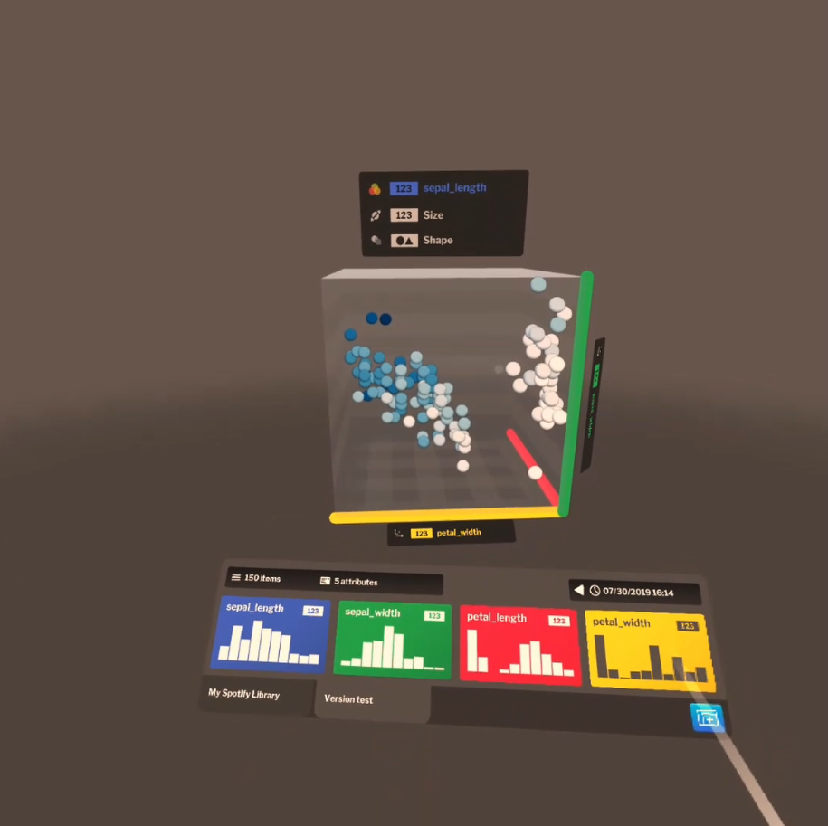

# Design

In this chapter we discuss **X**

## Personas

The following personas characterize potential users of our application.

### Novice


Frank is a hobbyist. He is capable of performing basic computer operations, such as browsing the Internet or using an office suite. Lately, he came across an interesting dataset that highlights population growth in different areas of the world over the past couple centuries. Frank is quite impatient when it comes to computers and gets easily frustrated with complex pieces of software. As such, he is looking for a tool that will enable him to view this data without too much hassle.

### Power user


Quinn is a senior data analyst working in meteorological agency. She possesses advanced programming skills and her current task is to build a networked swarm of drones that gather meteorological data from locations around her neighbourhood. She wants to remotely access the measured data and share measurements from particular days with her colleagues.

### IT administrator


Paul works as an IT technician at a corporate bank. He has been tasked by the company to find and recommend an immersive analytics platform to be used by its employees. Paul wants the software to store data locally in order to achieve compliance with new data regulations, integrate easily with existing processes inside the company and have the ability to audit the software. Although he is an experienced administrator with many years under his belt, he always enjoys software that is hassle-free to run and easy to set up.

## Goal

The goal of our research is to create a virtual reality visualization environment that is accessible to everyone, is easily extensible by outside developers and works on 3DOF and 6DOF HMDs, no matter whether they are connected to a personal computer or standalone. Different control styles should be taken into account when designing interactions.

[1]

## Feature selection

We have selected a number of features to implement for our first prototype, which was made in the space of 4 months (one academic semester). These include the ability to load comma-delimited CSV files into the environment, ability to update existing datasets by either overwriting the existing copy or appending a new copy (*versioning*), letting the user perform basic editing operations such as renaming dataset attributes, setting their data type and missing value setting and a basic dataset sharing feature.

The user should also be able to create scatter plots, position them freely around the virtual environment, adjust their rotation and scale, specify bounds for each spatial axis (*slicing*), assign dataset attributes onto spatial axes and non-spatial features such as color and size and view basic dataset metadata and statistics of attributes contained within said dataset.

Lastly, there should be integration support for popular programming languages that allows programmers to create or update datasets from their programming environment of choice. Since we cannot cater to all, we should provide the ability for outside developers to build their own integrations for other programming languages or environments.

## Component design

We have decided to divide our environment into three distinct components - plugins, Manager and Navigator. *Plugins* are API integrations written for different programming languages that allow the user to create a new dataset or update an existing one. *Manager* enables the user to view and edit all of their datasets and also facilitates uploading files from a local computer. *Navigator* allows the user to interact with their data in virtual reality. The following visualization pipeline shows the distribution of tasks among our components.

[1]

### Plugins

Plugins are intended for developers or power users to incorporate dataset creation and updating functionality into their applications and scripts. We have implemented integrations for Python and R, as they are the most common programming languages used by data scientists. Manager provides a set of APIs that enable outside developers to create their own integrations and as both Manager and official plugins are open-source[2], it is a very straightforward process.


From the user's perspective, the workflow to add or update a dataset is as follows:

1. Log into Manager.
2. Access the create/update dataset modal.
3. Select programming language or environment.
4. Copy API key that is unique for user (when creating a dataset) or dataset (when updating an existing dataset).
5. Import a library in the programming environment of choice.
6. Insert an applicable command.
7. Run your program.

The following code snippet showcases the use of plugins for adding a new dataset and updating an existing one in R.

```r
cyberplot.new(swiss, id = "304a87cff875bc23522557e5beda11ff", name = "Swiss Dataset")
cyberplot.update(iris3, id = "09fee44cff6a79cdf2a6176b2ffb1008")
```

### Manager

Manager is the name for our web component. It is meant to be installed on a virtual private server (VPS) and provides dataset storage as well as an interface for users to edit their datasets. In terms of architecture, it forms the central part of our environment, as both plugins and Navigator interacts with its APIs.


As it is a multi-user application, the user first has to create an account. After logging in, they are presented with a list of their datasets on a sidebar to the left. In the upper right corner of the screen, they can see their username and access a notification center, which is where they are able to answer share requests and, most importantly, access the VR headset management window. This window gives them information on headsets associated with their account, such as an identifier (name of HMD as well as the computer's domain name if provided by host OS) and time of association.

In the lower left corner is a button titled *Add new dataset*. Pressing it opens up a wizard for adding a dataset. The same wizard with slight differences is also used when updating a dataset. In the first step, the user can select their data source. If they choose a programming environment, they receive instructions on how to use the plugin system.


If they choose to create a dataset from local file, they are prompted to select a CSV file by either opening an OS-native file picker dialog or by dragging a file icon into their web browser. In the next step, they have to decide whether the first line of their file includes labels. After selecting an appropriate answer, the dataset is uploaded and appears in the sidebar. Attribute types are assigned automatically.


Clicking on a dataset in the sidebar brings up the dataset view, which contains select metadata (number of attributes, row count, timestamp of last edit), buttons for accessing various functions and a listing of all attributes. For each attribute, we can see its label, data type and a preview of its values. Clicking on an attribute brings up the attribute view that contains options to rename an attribute, change its data type (nominal, numerical, categorical, vector) and decide on which action to take in case some values are missing. With numerical attributes, we are able to view select statistical information, such as quartiles, mean and standard deviation.

If we return back to dataset-wide actions, we have the following options:
* Update dataset
* Manage dataset versions
* Download dataset file
* Share dataset with another user
* Rename dataset
* Delete dataset


Sharing a dataset allows us to select a user with whom to share. The next time they log in, they are presented with a notification that enables them to either accept or decline the share request. Should they accept, the dataset is copied onto their account.

Datasets can be updated in the same way as they are created, that is using a local file or via the plugin system. The system checks for any type discrepancies and will refuse upload of data incompatible with current attributes. By default, existing data is overwritten on update. However, we can choose to enable versioning in order to keep multiple copies of the same dataset, essentially adding a temporal dimension to our data. Examples of using this feature include a smart device for gathering data, which periodically uploads said data using the plugin system. Versions can be individually downloaded and deleted using the version management interface. Versioning can also be turned on or off on a per dataset basis.


### Navigator

Our VR component is called Navigator. When the user first launches Navigator on their VR headset, they are presented with a 5-digit numeric code, which is used for pairing their account. This system was chosen in order to mitigate poor text input capabilities in virtual reality. Originally, we had planned on using an input solution inspired by a project called Punchkeyboard, however doing so would only work in 6DOF, requiring us to use a traditional keyboard interface in 3DOF.[3] Moreover, we wanted to avoid using text wherever possible as contemporary virtual reality HMDs are still lacking in resolution and text legibility is noticeably impaired on headsets utilizing OLED display technology due to their subpixel arrangement. As such, we try to make maximum use of visual elements.


After logging in, the user can select one of their datasets, which is then loaded onto what we call a *data brush*, essentially a simplified version of Manager's dataset view. In the 3DOF version, the databrush is present in a fixed position in front of the user's pelvis and while its visibility can be toggled, it is visible for the most part. In the 6DOF version, the user can display the data brush by holding down the grip button. It is then displayed on top of one of their controllers. The data brush displays dataset metadata and attribute listings, which look similar to their Manager counterpart. In order to reduce the amount of text and provide more information, we have opted to display histograms in place of data preview for numerical attributes. The user can move between pages of attributes by utilizing a flick gesture using their controller's analog stick or touchpad. They are also able to switch between versions if versioning is on for selected dataset and load additional datasets. The users are able to have multiple datasets open at the same time.



Plots can be created by pointing at the floor and holding the trigger, which opens up a pie menu with available plot types. Selection can be made by moving the pointer onto an icon and releasing the trigger. This interaction enables the user to quickly create a plot anywhere inside the virtual environment. Plots can be moved around the user's current position by using the trigger and brought closer or further away by using the analog stick or joystick in conjunction with the trigger. If the user drags the plot far away, it turns red and, should the user release the trigger, is deleted from the scene.

Plots can also be rotated 90 degrees by pointing at them and using the aforementioned flick gesture. In 3DOF, we try to mitigate the lack of positional movement (which further enhances spatial perception) by offering a free-form rotation mode, which is triggered by pointing at the plot and pressing down on the touchpad. Doing so maps the rotation of a controller onto the rotation of the plot.

The plot can also be scaled, although the mechanics differ depending on the VR system used. In 6DOF, one can scale the plot by pointing at it with both controllers, pressing the trigger and dragging inwards or outwards, a fairly standard gesture in VR interface design. In 3DOF we are unable to use this gesture, as most 3DOF systems come with only one controller. We have instead chosen to utilize a twisting motion, where the user twists their wrist in order to control the plot's scale. Such interaction technique had been previously implemented in a VR game *Virtual Virtual Reality*.[4]


Attributes can be dragged from the data brush onto individual plots by using the trigger button. In the case of scatter plots, they can be assigned to spatial axes and non-spatial features like color and size. When we assign an attribute onto spatial axes, the position of nodes is smoothly interpolated to their new position in order to provide a visual cue to the user. Nodes are depicted as sprites in order to increase performance on mobile hardware. Once an attribute is assigned, it is color-coded on both the plot and the data brush. Color-coding persists until it is removed from all plots. Assignments can be reversed by using the trigger button.

Plots also display scales. For numerical attributes we display numerical values for a set number of steps, for categorical attributes, steps are made for each value. The user is able to slice the plot by creating bounds. These are created by pressing on a desired position on a scale.

1. (santos) https://www.sciencedirect.com/science/article/pii/S0097849304000251/
2. (github) https://github.com/cyberplot/
3. (punchkeyboard) https://uxdesign.cc/keyboard-input-for-virtual-reality-d551a29c53e9/
4. (vvr) https://tenderclaws.com/vvr/