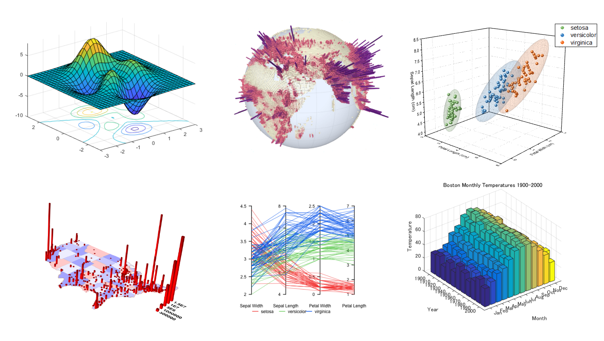
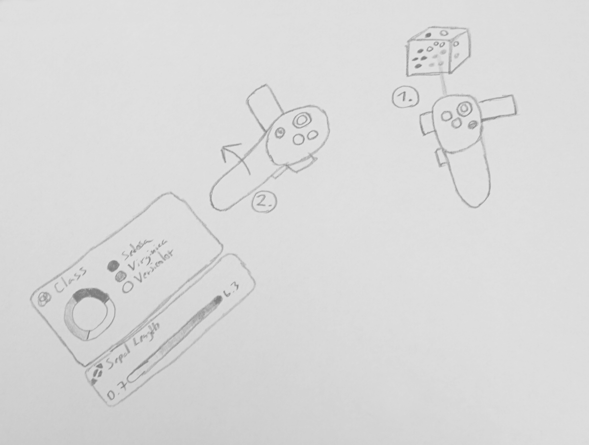

# Future

In this chapter we will go over the features that are going to form the focus of future development of our software.

## Plot types

So far, we have focused on scatter plots as a means to visualize our data. As part of development, we have also been able to test out bar plots and surface plots, which are going to be released alongside an update to Manager that will add support for data stored in two-dimensional matrices.

Additionally, when it comes to multivariate data, we would like to add support for visualizing geospatial data on either a plane or a globe, complete with satellite imagery, as well as support for parallel coordinate plots inspired by the techniques discussed in a related paper.[1]

## Brushing, linking

Brushing and linking techniques form an important part of any tool for interactive visualization. Brushing allows the user to select a subset of visualized data items with the goal of either emphasizing or deemphasising it in relation to other data. Linking allows for an extension of this functionality to other plots that are associated with the same dataset.[2]

## Sharing system

As discussed earlier, many similar tools leverage the power of presence in virtual reality to create multi-person sessions, where stakeholders can view and edit data plots and communicate with one another without leaving VR.

We plan to utilize an existing solution called Oculus Avatars, which despite its name is available for all major VR platforms.[3] We feel that brushing techniques form an integral part of the connected experience and as such, sharing system has a lower priority that the aforementioned features. The feature should allow all stakeholders to interact with visualizations at the same time, unlike ParaView's master-slave approach.

## Performance optimization

Due to time constraints, certain dataset-specific analytical functionality had been coded on the Navigator side. These operations are resource-intensive on large datasets and can introduce delays of hundreds of milliseconds on mobile hardware, resulting in somewhat sluggish UI performance. The goal is to move all such functionality to Manager.

In addition, it would be advantageous to introduce asynchronicity to the synchronization process that takes place after user opens up Navigator. In its current state, there is a delay of a couple seconds when downloading a large number of datasets.

## Legend

It is necessary to implement a plot legend for all non-spatial dimensions. Such UI element needs to be easily accessible, yet unobtrusive. As such we plan to position the element on a user's hand with the capability to show and hide it using a simple wrist twisting gesture akin to looking at a wristwatch.

## Immersion mode

In order to maximize the benefits of our immersive VR environment, we would like to introduce a so-called *immersion mode*, which would enable users to focus on a single plot while hiding the rest. Immersion mode would come with a brand new control set that would enable users to more effectively view the data. We would also be able to use this mode to render large plots in greater detail (by turning off subsampling) as all other plots would be hidden and thus would not use system resources.

1. (imaxes) https://dl.acm.org/citation.cfm?id=3126613
2. (linking) https://dl.acm.org/citation.cfm?id=949607.949633
3. (avatarsdk) https://developer.oculus.com/documentation/avatarsdk/latest/concepts/