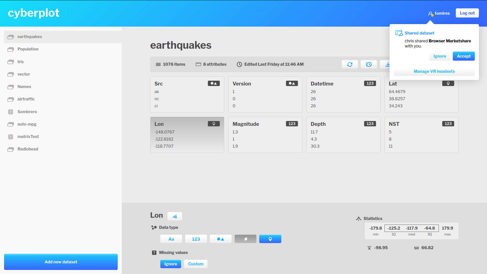

# Manager

Manager is the name for a component which enables the user to load datasets from their local computer and perform basic editing operations, such as data enrichment and attribute specification. In order to satisfy the design goal of mitigating all shortcoming of VR (*Focus on VR*), we have created a separate component that is to be accessible through a personal computer. Faclitation of collaboration, another of our design goals, demands that we create a centralized server node. 

This backend will provide the users with a user account system as well as a space to store all of their datasets and associated metadata. The design goal of availability specifies, that the VR portion of our application suite should be available on mobile and standalone headsets, as well as PC-based systems. As such, we had to figure out a way to access the data on any computer - an elegant solution is to create a web-based frontend.

To simplify our component design, we will use the term *Manager* to refer to both backend and frontend portions of this application, even though they are separate implementation-wise. Extensibility and data security will be achieved by open-sourcing the component, which enables outside developers to create integrations (*plugins*) and other stakeholders to audit the software.

## Required functionality

Users should be able to do the following:

- create a user account
- upload new datasets
- access previously uploaded datasets
- download previously uploaded datasets
- update an existing dataset
- change attribute types
- rename attribute labels and datasets
- share datasets
- delete datasets

## Wireframes

We began our design process by creating wireframes of the user interface. Two versions have been designed, the first includes two separate views. The first view includes a listing of all uploaded datasets along with basic metadata - time of the last edit and users the dataset has been shared with. The presentation is reminiscent of folder listing in Google Drive.[1] The second view contains basic dataset metadata along with a selection of dataset-specific actions on the right-hand side. Data preview contains a histogram where applicable and complete listing of data. It has been inspired by the UI of Kaggle.[2] Attribute-specific changes would have taken place inside a modal.

The second version includes a more compact interface with a listing of datasets in a sidebar on the left, dataset information in the center and attribute-specific information in the bottom-right portion of the screen. Dataset-specific actions are accessible in the upper portion of the screen, followed by the listing of attributes, which use a design consistent with the data panel in Navigator.

Most interaction takes place in modals, the following wireframe illustrates the process of adding a new dataset from local file. In accordance with the design goal of automatization, the user is only asked to input necessary information - in our case the user has to select whether headers are present in the file.

## Design stage

In this stage, we have created a low-fidelity prototype of our user interface based on the second version discussed earlier. Inkscape vector imaging software was used.[3] The full version of the low-fidelity design is included with this thesis as a digital copy.

## Implementation

The next stage included implementation of the component using Flask[4] and Vue.js[5] frameworks. Details are available in the chapter discussing used technology. The following two subsections include an overview of functionality available inside Manager.

### August build

As it is a multi-user application, the user first has to create an account. After logging in, they are presented with a list of their datasets on a sidebar to the left. In the upper right corner of the screen, they can see their username and access a notification center, which is where they are able to answer share requests and, most importantly, access the VR headset management window. This window gives them information on headsets associated with their account, such as an identifier (name of HMD as well as the computer's domain name if provided by host OS) and time of association.

In the lower left corner is a button titled *Add new dataset*. Pressing it opens up a wizard for adding a dataset. The same wizard with slight differences is also used when updating a dataset. In the first step, the user can select their data source. If they choose a programming environment, they receive instructions on how to use the plugin system.

If they choose to create a dataset from local file, they are prompted to select a CSV file by either opening an OS-native file picker dialog or by dragging a file icon into their web browser. In the next step, they have to decide whether the first line of their file includes labels. After selecting an appropriate answer, the dataset is uploaded and appears in the sidebar. Attribute types are assigned automatically.

Clicking on a dataset in the sidebar brings up the dataset view, which contains select metadata (number of attributes, row count, timestamp of last edit), buttons for accessing various functions and a listing of all attributes. For each attribute, we can see its label, data type and a preview of its values. Clicking on an attribute brings up the attribute view that contains options to rename an attribute, change its data type (nominal, numerical, categorical, vector) and decide on which action to take in case some values are missing. With numerical attributes, we are able to view select statistical information, such as quartiles, mean and standard deviation.

If we return back to dataset-wide actions, we have the following options:
* Update dataset
* Manage dataset versions
* Download dataset file
* Share dataset with another user
* Rename dataset
* Delete dataset

Sharing a dataset allows us to select a user with whom to share. The next time they log in, they are presented with a notification that enables them to either accept or decline the share request. Should they accept, the dataset is copied onto their account.

Datasets can be updated in the same way as they are created, that is using a local file or via the plugin system. The system checks for any type discrepancies and will refuse upload of data incompatible with current attributes. By default, existing data is overwritten on update. However, we can choose to enable versioning in order to keep multiple copies of the same dataset, essentially adding a temporal dimension to our data. Examples of using this feature include a smart device for gathering data, which periodically uploads said data using the plugin system. Versions can be individually downloaded and deleted using the version management interface. Versioning can also be turned on or off on a per dataset basis.

### December build

The December build of Manager includes the addition of a new attribute type for storing locations, a brand new installation script that allows the adminstrator to install from source code using a single command as well as a number of bugfixes.

The most significant feature is support for spatial datasets. When adding all-numeric datasets, user is asked to select whether the dataset in question is multivariate or spatial. Spatial datasets are compatible with certain plots inside Navigator, in both components they are represented as a single unified attribute with a special type.

1. (gdrive) https://www.google.com/drive/
2. (kaggle) https://www.kaggle.com/arshid/iris-flower-dataset
3. (inkscape) https://inkscape.org/
4. (flask) https://palletsprojects.com/p/flask/
5. (vuejs) https://vuejs.org/