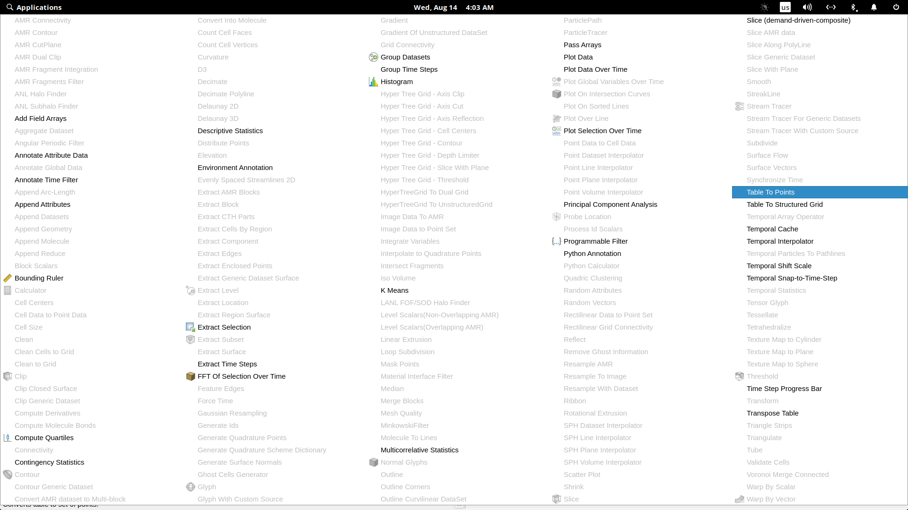

# Motivation

In this section we are going to go over several examples of traditional data analytics and business intelligence software, i.e. software that runs on a personal computer and utilizes a flat user interface. We will try to assess the ease of use and come up with reasons why VR might help us in this space.

## Analysis of desktop applications

This subsection introduces two applications that we have chosen and goes over their functionality and user interface design. We will attempt to complete a simple task of creating a scatter plot from a CSV file. In order to quantify the data for further comparison, we will make use of the keystroke-level model (KLM).[1] For explanation of the model and time values used, please see the appropriate section in the appendix.

### Example task list

1. Load Wine dataset from a CSV file.
2. Create a scatter plot.
3. Assign attributes onto spatial axes.
4. Map attribute to color.
5. Slice one of the spatial axes.

### ParaView

ParaView is an open-source application for data analysis and visualization.[2] It is available for Linux, macOS and Windows. In our analysis, we will focus on the software's visualization capabilities.

The user workflow is centered on so-called pipeline, which is presented to the user via a UI element called Pipeline browser. Here, the user can place actions, which then get applied incrementally, giving the user an option to jump back to a previous state in real time. Examples of actions include loading a file, creating a visualization of selected type and applying filters.

Other key parts of the user interface include a properties panel, which allows the user to modify parameters of a selected action in the pipeline, and the work area where visualizations are drawn. The user is also able to display other panels, which contain further statistical information on loaded dataset. Of particular note is a Color Map panel, which enables the user to choose between various color spaces. 

There is also a Collaboration panel, which enables multiple users to connect to one another using LAN and share the current state of the work area as well as communicate with one another using text messages. The user roles are clearly defined - one user acts as a master and has the ability to edit the project, while others act as slaves and cannot interact with the visualization.

We will start our usability test by opening our CSV file. ParaView supports a countless amount of input formats. After loading the data, it is analyzed and data types are automatically assigned, the user can choose a delimiter character and specify whether the dataset in question includes headers. To finish the loading process, the user has to click the *Apply* button. After loading the dataset they are presented with a tabular view of it in its entirety.

Next, we need to create a scatter plot. This is done in a very convoluted fashion by first selecting the dataset action in the pipeline browser and then opening up a menu via *Filters -> Alphabetical*. This menu takes up the entirety of the screen and contains many seemingly unrelated actions. An obvious choice for the user would be to select the *Plot Data* option, however they must instead select *Table to Points*.

The user is then free to select assignments for spatial axes using a drop down menu and map an attribute onto color in the same fashion. Clicking *Apply* and afterwards clicking the eye icon next to the filter renders the plot.

The plot appears to be stretched, so we have to scale it by first pressing the cog icon to enable advanced options, and then modifying scale values for each axis in the *Transforming* section by typing in random values until we are satisfied with the look of our plot.

As points are very small when we zoom in the plot, we set *Point Size* to a larger number. In order to be able to rotate the plot, we need to reset the pivot by pressing the *Zoom To Data* button in ParaView's toolbar.

The next step is to slice the data by using the clip filter. We add the filter using *Filters -> Alphabetical -> Clip*. It is appended to the end of our pipeline, however we need to copy the transform values to the new filter. Finally, we select the desired cutting plane using *X/Y/Z Normal* buttons and drag the plane to a position that we would like. In order to view original axes, we select the result of *Table to Points* filter in our pipeline.

The following table lists all KLM operations necessary to complete our task.

| Operator | Description | Time (s) |
|---|---|---|
| M | Initiate opening a file | 1.35 |
| M | Find file open button | 1.35 |
| PB | Point at the button and press it | 1.3 |
| PB | Select file and double click it | 1.3 |
| M | Find properties panel | 1.35 |
| PB | Point on *Apply* button and press it | 1.3 |
| M | Initiate plot addition | 1.35 |
| PBPPB | Open up *Filters* menu, navigate to *Alphabetical -> Table to Points* | 3.7 |
| M | Find *Properties* section of *Properties* panel | 1.35 |
| 3*(PBPB) | Select assignments from dropdown | 7.8 |
| M | Find *Coloring* section of *Properties* panel | 1.35 |
| PBPB | Select an assignment from dropdown | 2.6 |
| M | Find *Styling* section of *Properties* panel | 1.35 |
| PBHKH | Change value of point size | 2.38 |
| PB | Click on the eye icon to display filter | 1.3 |
| M | Find *Transforming* section of *Properties* panel | 1.35 |
| 6*(PBHKKKH) | Guess transform scales that make length of plot's axes equal | 17.64 |
| MPB | Find *Zoom to Data* button and press it | 1.3 |
| PBPPB | *Filters -> Alphabetical -> Clip* | 3.7 |
| PBPB | Click on the eye icon next to two recently added filters | 2.6 |
| M | Find *Transforming* section of *Properties* panel | 1.35 |
| 3x(PBHKKKH) | Fill in scale values from the previous filter | 8.82 |
| M | Find *Plane parameters* section of *Properties* panel | 1.35 |
| PB | Point and click on desired normal button to create a cutting plane | 1.3 |
| PBPB | Drag the cutting plane to desired position | 2.6 |
| PB | Click on *Apply* | 1.3 |
| PB | Select original filter to display its axes | 1.3 |

The total time to complete our tasks is 75.74 seconds. Overall, ParaView seems like a powerful tool, albeit with a very convoluted user interface. The tool's tutorial guide contains 159 pages, although it covers advanced functionality in its later chapters.

### Tableau

Tableau is a commonly used software for business intelligence. It allows the user to load data by opening a local file (CSV, JSON, Excel spreadsheet) or connecting to a database (MSSQL, Oracle, MySQL, Amazon Redshift and more). The number of database integrations is much larger than the number of supported types of local files indicative of the product's focus on enterprises and big data. The desktop application is available for Windows and macOS.[3]

The company also offers a product called Tableau Server which enables the users to store their data online using either a publicly hosted service or an on-premises server.

The client software includes a very straightforward and easy-to-use interface. The user loads a dataset and is presented with a tabular view. Data types are automatically detected, as is the column delimiter (in the case of CSV files). In this view, the user is also able to pre-filter data by selecting a threshold and filling in null values. They are then able to create a *sheet*, a metaphor commonly used in spreadsheet software. The user then selects attributes they would like to use by dragging them into a *Dimensions* list and afterwards can map them onto rows, columns and non-spatial features of the two-dimensional scatter plot.

Unfortunately, as of version 2019.2.2, Tableau does not have native support for three-dimensional plots. There is a workaround for creating pseudo-3D plots, but it requires the use of a SQL database and is not user-friendly at all, being more of a hack than a proper solution.[4]

The following table lists all KLM operations necessary to complete a simplified task of creating a two-dimensional scatter plot.

| Operator | Description | Time (s) |
|---|---|---|
| M | Initiate opening a file | 1.35 |
| M | Find *More...* button on sidebar | 1.35 |
| PB | Point at the button and press it | 1.3 |
| PB | Select file and double click it | 1.3 |
| M	| Locate *Sheet1* tab | 1.35 |
| PB | Point at the tab and press it | 1.3 |
| M | Locate *Measures* and *Dimensions* lists | 1.35 |
| 3*(PBPB) | Move attributes we want to display from *Measures* to *Dimensions* | 7.8 |
| M | Locate plot dimension settings | 1.35 |
| 2*(PBPB) | Move spatial attributes from *Dimensions* list to *Columns* and *Plots* respectively | 5.2 |
| 2*(PBPB) | Click on both assignments and select *Continuous* from dropdown menu | 5.2 |
| PBPB | Move one attribute from *Dimensions* onto *Color* subsection of *Marks* panel | 2.6 |
| M | Locate axis we want to slice | 1.35 |
| PBPB | Right click on the axis and select *Edit Axis* from dropdown | 2.6 |
| PB | Select *Fixed* radio button | 1.3 |
| PBHKKKH | Input desired value to *Fixed end* textbox | 2.94 |
| PB | Close the modal | 1.3 |

The total time to complete our tasks is 40.94 seconds, half the time of a similar workflow in ParaView. However, we have only been able to create a two-dimensional scatter plot due to software's limitations.

## Benefits of VR

We believe that virtual reality has the potential to enhance the visualization experience. Let us explore several reasons why.

### Stereoscopic view, 6DOF

Head-mounted displays (HMD) are by design stereoscopic. One study compared error rates on a conventional monitor against a stereoscopic solution with eye separation (interpupilary distance, IPD) of 6.4 cm. It also focused on the benefits of dynamic motion for perception.

The findings were that the use of both dynamic motion and stereoscopy significantly reduced error rates (by 10% in inexperienced participants, n=14 and 15-30% in experienced participants, n=2). Combination of these two methods led to further improvement.[5]

With modern HMDs we can leverage both of these methods as 6 degrees of freedom (6DOF) headsets allow the user to freely position their head in space, simulating motion.

### Spatial interface

Researchers and designers alike have been looking at replacing the traditional Windows-Icons-Menus-Pointing (WIMP) desktop metaphors with 3D alternatives since the early 90s. The new interfaces instead rely on hand gestures and speech recognition to navigate around 3D space. One article from the era argues that users are frustrated by many layers of *point and click* and visual clutter that is common with WIMP UIs and discusses the limitations of relying exclusively on the sense of sight. The author prophesizes rise of virtual reality and proceeds to discuss potential applications.[6]

Innovative examples such as Google Earth VR prove that well-designed spatial interfaces have the potential to make UI more intuitive, especially to first-time users.[7]

### Immersive analytics

The full use of one's visual field as well as senses of touch (through force feedback) and spatial sound allows the user to fully immerse themselves into their data, which has potential to improve their concentration. Furthermore, they have the ability to invite other users into their virtual space, which allows for multi-user interactions with plots inside the space.

1. (klm) https://dl.acm.org/citation.cfm?doid=358886.358895
2. (paraview) https://www.paraview.org/
3. (tableau) https://www.tableau.com/
4. (tableau3d) https://boraberan.wordpress.com/2015/12/18/going-3d-with-tableau/
5. (ware) https://dl.acm.org/citation.cfm?id=1279642
6. (wimp) https://dl.acm.org/citation.cfm?id=253708
7. (earthux) https://www.gdcvault.com/play/1024762/UX-in-Google-Earth-VR/