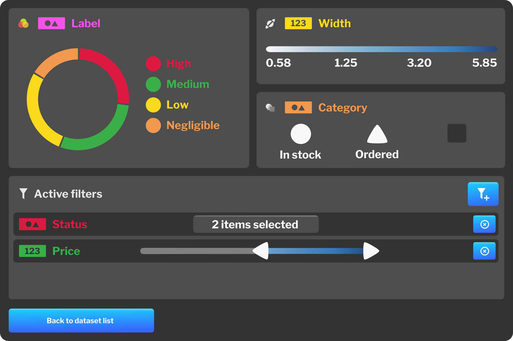

# Navigator

Navigator is the name for the virtual reality component of our application. It is designed to be used in a wide variety of headsets, including mobile, standalone and PC-based systems, and support both 3DOF and 6DOF tracking.

The original intent was to design two different versions of the application, one with support for room-scale interactions (for 6DOF headsets) and a scaled-down version for 3DOF headsets, however we have decided later in the design process to combine the two as the room-scale version required physical movement between plots, which are distributed around the space. This was deemed uncomfortable and the two versions were merged into one. There are minor differences in both the user interface and user experience between the two, but the basic interaction methods remain the same.

## Required functionality

Users should be able to do the following:

- associate Navigator with their account
- access datasets previously uploaded with Manager
- create plots detailed in the design chapter
- assign attributes onto plots
- conduct basic data filtering
- position plots in space
- view statistics
- collaborate with other users using avatars

## Interaction design

We began the design process by creating sketches that highlight interaction techniques used within Navigator. Let us start by introducing the two pivotal user interface elements - the attribute and the plot. The attribute element displays the label, type of the attribute as well as a data preview.

Plots can be positioned around the user and depending on plot type, a number of features can be assigned to. As discussed previously, the scatter plot accepts assignments to its spatial axes and four non-spatial features - color, size, shape and label. Assignments are made by dragging the attribute from the data panel onto the feature label.

Four shapes were designed for use as glyphs in scatter plots. The following 3D shapes have been selected due to their geometry, which is recognizable from every angle.

The original design included a *hot corners* feature, which enabled the user to physically grab corners of plot in 6DOF and stretch the plot by doing so. The August release substituted this feature for a more conventional resizing gesture. The faces of a plot's bounding box were to be used for setting bounds on spatial axes. Both features were replaced in the August build due to their reliance on room-scale - the user was supposed to move around the room, which would make the experience uncomfortable. They were also incompatible with 3DOF input methods.

The 6DOF version includes a panel attached to one of the controllers. This is possible due to the fact that 6DOF systems utilize two controllers - the other controller can be used for dragging the attribute from the panel.

3DOF version offers no such luxury - the panel is fixed in space. The plot can be moved along paths that resemble concentric rings and also pushed away from or towards the user. This design was subsequently used in both 3DOF and 6DOF, due to its comfort.

Another limitation of 3DOF headsets is their controller (provided there is any). The following sketch shows input options of an Oculus Go controller along with bindings for Navigator.

## January build (1901)

The January build highlighted basic interactions in 3DOF. User interface design was influenced by Google's Material Design[1] and a tech demo called Daydream Elements.[2] The user was able to select one of the preloaded datasets, create scatter plots, position them in space and assign attributes to them. The design of dataset panel remained unchanged in later revisions. Attributes are color-coded on assignment, which is useful when working with multiple plots. In this version, the user can assign attributes onto spatial axes of a plot as well as the color feature, however the functionality is still quite basic - spatial axes only support numerical attributes, while the color feature only accepts categorical attributes. The background used a mixture of white and light gray and has been scrapped in future revisions due to the fact that it caused fatigue.

## Lo-fi prototype

The next stage of prototyping involved using Microsoft Maquette. More detailed versions of panels discussed in the subchapter on interaction design were created, this time taking multiple datasets into account.

New hierarchy was introduced around this time, alongside terminology like space and version. *Space* is defined as an area in which visualization takes place. Inside the space, the user can interact with multiple *datasets*, which can contain multiple versions. Attributes from datasets can be assigned to a number of *plots*, which in turn display data from the currently selected *version*.

## August build (1908)

The August build of Navigator added integration with Manager. When the user first launches Navigator on their VR headset, they are presented with a 5-digit numeric code, which is used for pairing their account. This system was chosen in order to mitigate poor text input capabilities in virtual reality.

After logging in, the user can select one of their datasets, which is then loaded onto what we call a *data brush*, essentially a simplified version of Manager's dataset view. In the 3DOF version, the databrush is present in a fixed position in front of the user's pelvis and while its visibility can be toggled, it is visible for the most part. In the 6DOF version, the user can display the data brush by holding down the grip button. It is then displayed on top of one of their controllers. The data brush displays dataset metadata and attribute listings, which look similar to their Manager counterpart. In order to reduce the amount of text and provide more information, we have opted to display histograms in place of data preview for numerical attributes. The user can move between pages of attributes by utilizing a flick gesture using their controller's analog stick or touchpad. They are also able to switch between versions if versioning is on for selected dataset and load additional datasets. The users are able to have multiple datasets open at the same time.

Plots can be created by pointing at the floor and holding the trigger, which opens up a pie menu with available plot types. Selection can be made by moving the pointer onto an icon and releasing the trigger. This interaction enables the user to quickly create a plot anywhere inside the virtual environment. Plots can be moved around the user's current position by using the trigger and brought closer or further away by using the analog stick or joystick in conjunction with the trigger. If the user drags the plot far away, it turns red and, should the user release the trigger, is deleted from the scene.

Plots can also be rotated 90 degrees by pointing at them and using the aforementioned flick gesture. In 3DOF, we try to mitigate the lack of positional movement (which further enhances spatial perception) by offering a free-form rotation mode, which is triggered by pointing at the plot and pressing down on the touchpad. Doing so maps the rotation of a controller onto the rotation of the plot.

The plot can also be scaled, although the mechanics differ depending on VR system used. In 6DOF, one can scale a plot by pointing at it with both controllers, pressing the trigger and dragging inwards or outwards, a fairly standard gesture in VR interface design. In 3DOF we are unable to use this gesture, as most 3DOF systems come with only one controller. We have instead chosen to utilize a twisting motion, where the user twists their wrist in order to control the plot's scale. Such interaction technique had been previously implemented in the VR game *Virtual Virtual Reality*.[4]

Attributes can be dragged from the data brush onto individual plots by using the trigger button. In the case of scatter plots, they can be assigned to spatial axes and non-spatial features like color and size. When we assign an attribute onto spatial axes, the position of nodes is smoothly interpolated to their new position in order to provide a visual cue to the user. Once an attribute is assigned, it is color-coded on both the plot and the data brush. Color-coding persists until the attribute in question is removed from all plots. Assignments can be reversed by using the trigger button.

Scatter plots also display scales. For numerical attributes we display numerical values for a set number of steps, for categorical attributes, steps are made for each value. The user is able to slice the plot by creating bounds. These are created by pressing on a desired position on a scale.

## Lo-fi prototype #2

The next iteration of prototyping revolved around work on immersive mode, statistics panel, collaboration features and a filtering interface.

Immersive mode is a feature that enables the user to physically enter one of the plots. In addition to enabling the user to immerse themselves in a subset of data, it also allows us to do some technical optimization, an example of which is rendering glyphs in scatter plots. When immersive mode is inactive, all glyphs are rendered as billboarded sprites. Upon entering immersive mode, they change into 3D meshes, which is a necessity given they can move much closer to the user.

When the user enters immersive mode, they have the option of displaying statistics for non-spatial features of the plot. These are displayed on a panel above the controller.

Collaborative features allow the user to invite their colleagues from within the data brush. They can also see their avatars along their sides or, in the case of immersive mode, anywhere inside the plot. Body, head and controller positions are tracked and transmitted over the network, allowing for the utilization of pointing gestures. Voice communication is also enabled.

The last feature that we have prototyped is a plot-specific filtering system. It enables the user to select any numerical attribute from the current dataset and change the range of displayed values. This is an extension of the existing *slicing* mechanic present in scatter plots.

## December build (1912)

The December build introduced a variety of new functionality, most notably immersion mode and multiple plot types. Several changes were also made to existing UI elements based on feedback.

Users now have the ability to choose from 5 distinct plot types. These are selectable from a redesigned pie menu, which features new iconography. Two new attribute types debut in Navigator with the introduction of locational and spatial attributes. The former can be used with globe and map plots, while the latter can be assigned onto box and surface plots.

Free-form rotation mode from the previous version was replaced by the all-new immersive mode. Inside immersive mode, the user can move freely in three dimensions by pointing their controller in a certain direction and pulling on the analog stick or by using the touchpad. A grid is displayed in the background as the user moves around the space in order to reduce the risk of motion sickness. This technique was borrowed from Google Earth VR.[5] As mentioned previously, a statistics panel, dubbed the *Swatch* can be displayed at the user's convenience.

The motivation for creating the statistics panel was a need to show context for non-spatial features of a plot. The initial design had the user flick their wrist akin to looking at a wristwatch in order to reveal the interface. Later revisions reused the same panel that is used for the data brush.

The final design contains a smaller panel which allows the user to toggle between different non-spatial features of the graph. The layout changes depending on assigned attribute.

If a categorical attribute is assigned to the color feature, a pie chart is displayed. A gradient alongside quartiles is displayed for numerical attributes. Mapping onto quartiles is used as a compromise, as suggested by an article found online.[6]

The size feature in scatter plots only allows for assignment of numerical attributes. Quartiles are displayed.

When mapping a numerical attribute onto the shape feature, the values are divided into two bins of equal or similar size based on the median value. Each bin is then assigned a shape. If the attribute in question is categorical, unique values are mapped onto three distinct shapes. If more than three unique values exist, one of the shapes is used for multiple values.

1. (materialdesign) https://material.io/design/
2. (daydreamelements) https://developers.google.com/vr/elements/overview
3. (msmaquette) https://www.maquette.ms/
4. (vvr) https://tenderclaws.com/vvr/
5. (earthux) https://www.gdcvault.com/play/1024762/UX-in-Google-Earth-VR/
6. (colormapping) https://academy.datawrapper.de/article/117-color-palette-for-your-map